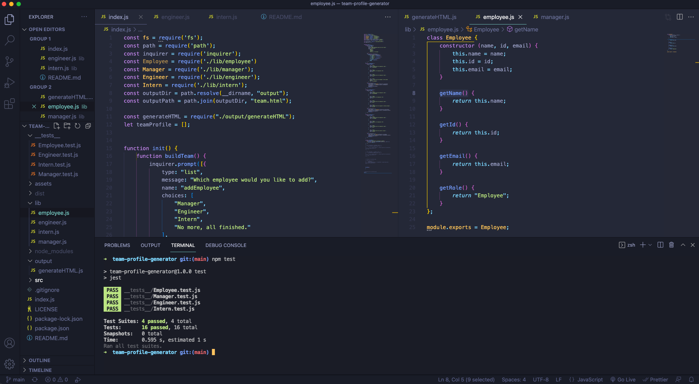

# Team Profile Generator

## Description

This project was to create a team profile generator by using command-line features with node and the inquirer npm to generate html of the selected user input. By dynamically generating and capturing  a user's feedback to prompted questions, a user can get a high-quality file created. Tests were also written utilizing the Jest npm to help determine any issues that could arise in the code.

- [Installation](#installation)
- [Usage](#usage)
- [Credits](#credits)
- [License](#license)

## Installation

The files along with the assets folder can be used as a command-line interface using any computer based terminal instance. A video walkthrough of how the generator works and the process can be found at: https://drive.google.com/file/d/1eOrIIFkWm1vFxRjJu6Kqedk5hCOBn0Za/view?usp=sharing

## Usage

The files can be viewed using any desktop browser for viewing.

## Credits

Collaborators on this project include the UPENN bootcamp cohort, teaching staff, and tutor Alexis San Javier who helped make edits to this project. Some concepts and syntax tips were learned from Colt Steele and his Udemy Bootcamp course.

## License

MIT License

Copyright (c) [2021] [Daniel Westiner]

Permission is hereby granted, free of charge, to any person obtaining a copy
of this software and associated documentation files (the "Software"), to deal
in the Software without restriction, including without limitation the rights
to use, copy, modify, merge, publish, distribute, sublicense, and/or sell
copies of the Software, and to permit persons to whom the Software is
furnished to do so, subject to the following conditions:

The above copyright notice and this permission notice shall be included in all
copies or substantial portions of the Software.

---
